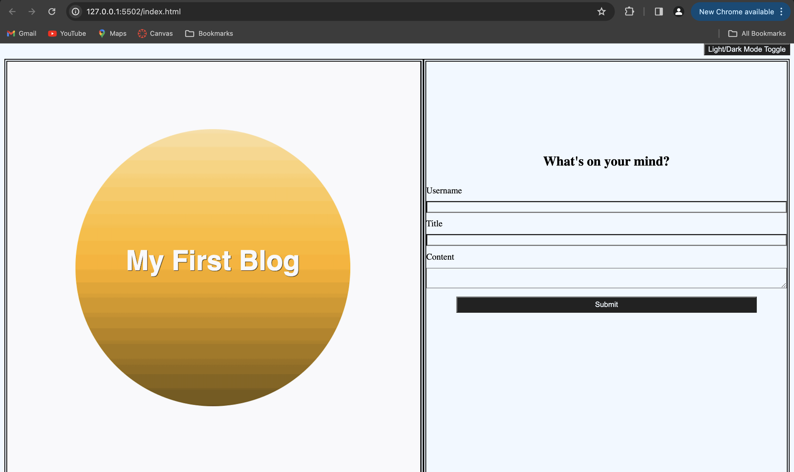

# Personal-Blog

## Description 
This project utilizes the programming languages of Javascript to add logic to a webpage crafted using HTML and styled using CSS. This webpage actively updates to reflect changes made within a website's landing page and allows users to input their credentials: username, title, and content to compose a blog post. After collecting the necessary information from the user, it displays the inputted values in a stacked layout with each blog ordered vertically on the page. The final product of this webpage allows the user to toggle a button and switch between a light and dark mode theme. 

## Usage

## Credits 
Sought out assistance from the websites and resources listed below: 
-- [X] https://developer.mozilla.org/en-US/docs/Web/HTML/Element/input
- [X] AskBCS
- [X] https://stackoverflow.com/questions/13318903/fill-parent-container
- [X] TA - Akon 
- [X] https://stackoverflow.com/questions/8067510/onclick-javascript-to-make-browser-go-back-to-previous-page
- [X] https://developer.mozilla.org/en-US/docs/Web/API/Window/localStorage
- [X] https://stackoverflow.com/questions/31559523/how-to-stack-items-above-each-other-with-flex-box
- [X] https://stackoverflow.com/questions/15629511/how-can-i-make-my-footer-center-to-the-bottom-of-the-page
- [X] https://www.shecodes.io/athena/9580-how-to-create-a-box-with-html-and-css

## License 
MIT